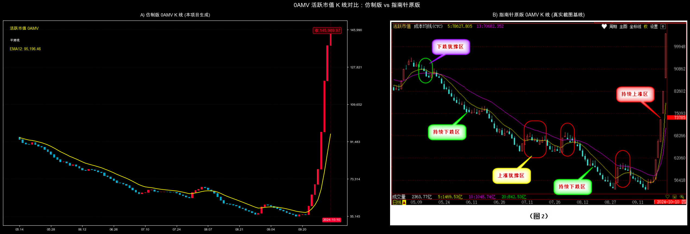

# 0AMV 活跃市值指标民间公式研究

本项目整理并实现公开流传的 0AMV（活跃市值／活筹指数）公式，提供 Python 计算、qlib 表达式以及基于真实沪深市场成交额的复现工具。

> [!IMPORTANT]
> 指南针官方公开了 0AMV 的指标含义，但未公开计算方法。本项目输出的是民间公式构造的**成交额代理指标**，不是经过官方确认的指南针原版，也不能解释为真实活跃筹码市值。

## 研究状态

| 项目 | 状态 | 说明 |
|---|---|---|
| 民间公式实现 | 已完成 | 支持成交额公式与价格调整公式两种口径 |
| 全市场数据复现 | 已完成 | 使用上证指数与深证综指的真实成交额聚合 |
| 同日期截图对照 | 已完成 | 复现窗口与 2024 年指南针截图一致 |
| 原版数值误差评估 | 暂不可用 | 缺少连续、可机器读取的指南针原版序列 |
| 0DMV 推导 | 不支持 | 民间成交额代理不满足 `0AMV + 0DMV = 流通市值` |

## 核心公式

默认使用公开资料中明确标为 0AMV／活筹指数的成交额公式：

```text
VAR1 = SMA(全市场 AMOUNT, 10, 1) / 1e7

close = VAR1
open  = REF(VAR1, 1)

C5  = DMA(SMA(VAR1, 3, 1), VOL / 0.02 / CAPITAL)
C13 = DMA(SMA(VAR1, 3, 1), VOL / 0.10 / CAPITAL)
C34 = DMA(SMA(VAR1, 3, 1), VOL / 0.18 / CAPITAL)
C∞  = DMA(VAR1, VOL / 1.10 / CAPITAL)
```

其中：

- `AMOUNT` 为沪深全市场每日成交额，单位为元；
- `VOL` 与 `CAPITAL` 必须采用一致的股数单位；
- `SMA(X, N, 1)` 为通达信递推平滑，不是简单移动平均；
- `DMA(X, A)` 为动态移动平均，权重由换手率决定。

公开资料中还存在以下价格调整版本：

```text
SMA(AMOUNT, 10, 1) × CLOSE / MA(REF(CLOSE, 1), 5) / 1e7
```

该版本在本项目中以 `formula_variant="price_adjusted"` 显式保留，不作为默认 0AMV 口径。

## 环境准备

项目要求 Python 3.10 或更高版本。核心计算依赖 `numpy` 和 `pandas`；图表复现与测试还需要 `matplotlib`、`Pillow` 和 `pytest`。

```bash
git clone https://github.com/WdBlink/compass-0amv-imitate.git
cd compass-0amv-imitate

python3 -m venv .venv
source .venv/bin/activate
python -m pip install numpy pandas matplotlib pillow pytest
```

## 快速开始

以下示例下载指定窗口的沪深市场成交额，并计算标准版 0AMV 代理指标：

```python
from validation.market_data import load_mainland_market_amount
from zero_amv import compute_0amv

market = load_mainland_market_amount("2024-01-01", "2024-10-10")
result = compute_0amv(market[["amount"]], fit_level="standard")

print(result.tail())
```

如果已经准备好自己的全市场数据：

```python
from zero_amv import compute_0amv

# Lite / Standard：仅要求 amount（元）
standard = compute_0amv(df[["amount"]], fit_level="standard")

# Full：额外要求同口径的 volume（股）与 capital（股）
full = compute_0amv(
    df[["amount", "volume", "capital"]],
    fit_level="full",
)
```

### 输出字段

| 层级 | 字段 | 含义 |
|---|---|---|
| Lite | `0amv_close` | 十日递推平滑后的全市场成交额代理 |
| Lite | `0amv_life_line` | `0amv_close` 的 EMA12 平滑线 |
| Lite | `0amv_change_pct` | 代理指标日变化率（百分比） |
| Standard | `0amv_open/high/low` | 由当日值与前一日值构造的绘图区间 |
| Standard | `0amv_color` | 上升为 1，下降为 0，无法判断为缺失值 |
| Full | `0amv_c5/c13/c34/infinite` | 公开民间公式中的换手率动态均线 |

### 公式口径参数

```python
from zero_amv import FormulaVariant, compute_0amv

legacy = compute_0amv(
    df,
    formula_variant=FormulaVariant.PRICE_ADJUSTED,
    fit_level="standard",
)
```

`scale_factor` 默认值为 `1.0`。只有获得同日期、连续的指南针导出值后，才应使用 `calibrate_scale(proxy, ground_truth)` 标定；截图十字光标标签不能作为收盘真值。

## 数据与验证

验证脚本通过东方财富历史日线接口分别获取上证指数和深证综指成交额，再按交易日求和。原始分市场列 `sh_amount`、`sz_amount` 会保留在 DataFrame 中，便于审计聚合口径。

```bash
# 运行全部测试
python -m pytest -q

# 生成与 2024 年原版截图相同时间窗口的并排对照图
python validation/make_side_by_side.py

# 生成最近窗口的指标图
python validation/render_imitate_kline.py

# 重新计算多空区间及其独立评估指标
python validation/detect_regimes.py
```

### 同窗口形态对照



该图可以检查大体方向和拐点是否相似，但不能据此计算相关系数或绝对误差：截图中的红色日期与数值标签来自十字光标，且没有可导出的逐日原始值。

### 多空区间评估

多空区间检测是建立在 0AMV 代理之上的独立规则系统，不等同于公式拟合度。当前真实成交额复现结果为：

| 指标 | 结果 |
|---|---:|
| 事件 Precision | 58.3% |
| 事件 Recall | 53.8% |
| 事件 F1 | 56.0% |
| 逐日 F1 | 51.9% |
| 逐日 IoU | 35.0% |

事件评分采用一对一匹配，避免一段超长预测区间同时命中多个真实区间。结果用于评估当前阈值和状态机，不应表述为“0AMV 拟合准确率”。

## qlib 集成

`QLIB_EXPRESSIONS` 与 `trading_analyze_integration.py` 提供了成交额公式的 qlib 表达式。需要特别注意：普通单股票 instrument 的 `$amount` 只是个股成交额；只有输入本身是预先聚合的全市场序列时，这些表达式才具有 0AMV 代理含义。

## 项目结构

```text
.
├── zero_amv.py                       # 核心计算与 qlib 表达式
├── trading_analyze_integration.py    # TradingAnalyze / qlib 集成片段
├── test_zero_amv.py                  # 核心公式测试
├── test_regime_evaluation.py         # 区间评分测试
└── validation/
    ├── market_data.py                # 沪深市场成交额下载与聚合
    ├── make_side_by_side.py          # 同日期窗口截图对照
    ├── render_imitate_kline.py       # 指标图渲染
    ├── detect_regimes.py             # 多空区间状态机及评估
    └── output/                        # 可复现输出
```

## 已知限制

1. 指南针原版算法属于未公开实现，本项目只能验证公开民间公式。
2. 当前截图不足以提供逐日真值，因此不报告相关系数、MAE、MAPE 或所谓“拟合度 95%”。
3. 上证指数与深证综指成交额之和是可复现的全市场代理，但仍可能与指南针历史股票池和数据清洗口径不同。
4. 将单只股票数据代入只能得到个股成交额代理，不能称为大盘活跃市值。
5. 本项目不构成投资建议，也不应用于直接生成实盘交易指令。

进一步提高精度需要连续的指南针 0AMV 原始序列。取得数据后，应预先固定训练集和样本外窗口，并报告方向一致率、相关系数、MAE/MAPE 以及不同市场阶段的稳定性。

## 参考资料与数据来源

- [北京指南针：经典指标之 0AMV](https://www.compass.cn/shownews.php?nid=1976015)——官方指标含义与使用说明，未公开算法。
- [公式网：指南针的 0AMV 活跃市值转成通达信指标](https://www.gpxiazai.com/gpgs/html/36759.html)——成交额版本民间公式来源之一。
- [同花顺公式平台：OAMV 活筹指数](https://poi.10jqka.com.cn/store/formula/detail/indexid/68942)——另一份公开民间实现，用于核对公式分歧。
- [东方财富：上证指数](https://quote.eastmoney.com/zs000001.html)与[深证综指](https://quote.eastmoney.com/zs399106.html)——验证脚本的数据来源。

## License

本项目采用 [MIT License](LICENSE)。公开民间公式与第三方数据的使用仍应遵守各自来源的条款。
